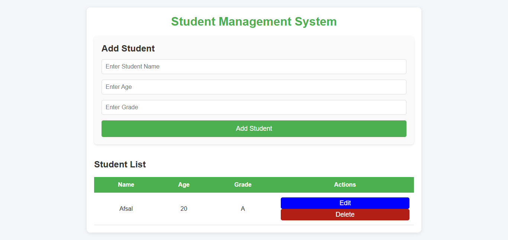

# Student Management System - TypeScript

This is a **Student Management System** built using **TypeScript**. The system allows users (admins or teachers) to manage student records with full CRUD (Create, Read, Update, Delete) functionality. This includes adding new students, updating their details, and deleting records.

## Features:
- **Create**: Add new student records.
- **Edit**: Modify existing student details.
- **Delete**: Remove student records from the system.
- **View**: List all students in the system.

## Tech Stack:
- **Backend**: TypeScript (Node.js and Express.js)
- **Database**: In-memory storage or you can connect to a database (e.g., MongoDB, PostgreSQL)
- **Frontend**: Optional (can be built with React.js or plain HTML/CSS)
- **Package Manager**: npm or yarn

## Folder Structure

The folder structure for the project is as follows:

